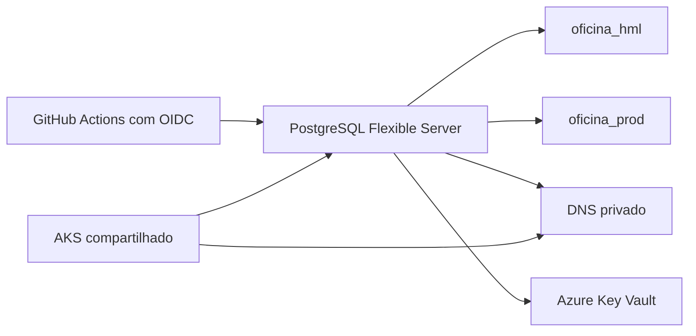

# soat-postgres-infra

Infraestrutura Terraform do PostgreSQL gerenciado da plataforma SOAT. Cada
ambiente cria um Azure Database for PostgreSQL Flexible Server privado e usa
outputs da foundation do repositório `soat-aks-infra`.

## Arquitetura



O banco recebe subnet delegada e DNS privado da foundation. Não há endpoint
público. Consulte o [diagrama central](https://github.com/JoaoGW/soat-api/tree/main/docs/architecture).

## Ambientes

- `environments/hml`: Flexible Server PostgreSQL 16, banco `oficina_hml` e
  administrador `soat_hml_admin`.
- `environments/prod`: Flexible Server PostgreSQL 16, banco `oficina_prod` e
  administrador `soat_prod_admin`.

Os servidores usam SKU `B_Standard_B1ms`, 32 GB, backup por sete dias, TLS
obrigatório, sem rede pública, geo-backup ou alta disponibilidade. As senhas
são aleatórias e apenas o `DATABASE_URL` com `sslmode=require` é gravado no
Key Vault. O papel de aplicação de menor privilégio será criado pela migration
privada da Fase 5.

As decisões de rede, logs de auditoria e gestão do segredo estão detalhadas em
[docs/seguranca.md](docs/seguranca.md).

O servidor HML está ativo, privado e é consumido pela Function e API HML. A
topologia produtiva permanece interna e sem endpoint público; os segredos são
referenciados pelo Key Vault, nunca registrados neste repositório.

## Pré-requisitos

- Foundation do `soat-aks-infra` aplicada com sucesso e state remoto acessível;
- Azure CLI, Terraform 1.9.8, TFLint e Trivy;
- OIDC bootstrap concluído e identities de PostgreSQL configuradas no GitHub;
- crédito, quota e SKU validados antes de habilitar deploy.

Copie os arquivos `*.example` para arquivos locais ignorados e preencha os
identificadores reais do state. Um plano local não usa backend automaticamente:

```bash
terraform -chdir=environments/hml init -backend-config=.backend.hcl
terraform -chdir=environments/hml plan
```

## CI/CD e segurança

PRs executam formatação, validação, TFLint, Trivy e plano somente leitura após
o bootstrap OIDC. `development` aplica `hml` e `main` aplica `prod` apenas se
o Environment correspondente tiver `TF_APPLY_ENABLED=true`.

As variáveis não sigilosas são `AZURE_TENANT_ID`, `AZURE_SUBSCRIPTION_ID`,
`AZURE_CLIENT_ID`, `AZURE_CLIENT_ID_PLAN`, `TF_STATE_RESOURCE_GROUP`,
`TF_STATE_STORAGE_ACCOUNT`, `TF_STATE_AKS_CONTAINER`,
`TF_STATE_POSTGRES_CONTAINER` e `RESOURCE_NAME_SUFFIX`. Não são usados client
secrets, credenciais Azure persistentes ou senhas de banco no GitHub.

O destroy requer `DESTRUIR` e `TF_DESTROY_ENABLED=true`, devendo ser executado
somente após as evidências da apresentação.

## Validação local

```bash
terraform fmt -check -recursive
for stack in environments/hml environments/prod; do
  terraform -chdir="$stack" init -backend=false -input=false
  terraform -chdir="$stack" validate
done
tflint --recursive
trivy config --exit-code 1 --ignorefile .trivyignore .
```

Este repositório não possui Dockerfile: entrega infraestrutura como código,
não uma aplicação executável. Swagger e Postman não se aplicam a Terraform;
consulte o [Swagger HML](http://20.226.244.207/docs) e a
[coleção central](https://github.com/JoaoGW/soat-api/blob/main/docs/postman/oficina-api.postman_collection.json).
